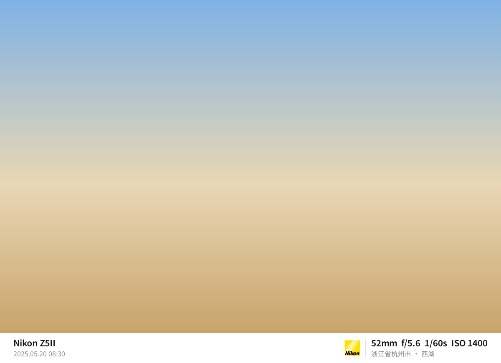

# 照片水印（PhotoEditor）

一个自用的安卓 App：把照片自带的拍摄信息（时间、机型、镜头、焦距、光圈、快门、ISO）和位置印到照片上，另存为新图，原图不动。

## 效果

| 参数边框 | 信息叠加 |
|---|---|
|  |  |

示例图由单元测试 `WatermarkRendererTest` 自动生成，底图是渐变色块，不是真实照片。

## 安装

- **正式版（推荐）**：用手机浏览器打开 [Releases 里的最新正式版](https://github.com/fenghanyue/PhotoEditor/releases/latest)，下载 APK 后直接安装。
- **测试版**：[最新测试版](https://github.com/fenghanyue/PhotoEditor/releases/tag/latest-dev) 是正在开发的代码，每次推送都会自动重新编译，可能有问题。

第一次安装时，需要允许浏览器"安装未知应用"。新版本可以直接覆盖安装旧版本；如果装过更新的测试版，再装较早的正式版会提示安装失败，要先卸载。

App 首页会显示版本号：正式版如 `0.3.0`，测试版后面带编译序号，如 `0.3.0-build12`。每个版本改了什么见[更新记录](CHANGELOG.md)。

## 进度

- [x] M0 搭架子：工程、自动编译、固定签名
- [x] M1 读信息：相册页、照片信息详情页
- [x] M2 出图：参数边框、信息叠加两套模板，预览和导出
- [x] M3 位置：离线省/市/区县查询和手动选择
- [ ] M4 批量和设置：批量导出、记住设置、手机机型名称、更多品牌 Logo

还没做的事记在 [Issues](https://github.com/fenghanyue/PhotoEditor/issues) 里。

## 怎么用

在相册里点一张照片，进入"加水印"页：选模板（参数边框 / 信息叠加），调好选项，点"保存到相册"。新图存在 `Pictures/PhotoEditor/`，文件名后面加 `_wm`，原图不动。右上角的 ⓘ 可以查看照片里读出来的全部信息。

地区（不用联网）：

- 带 GPS 的照片，按 GPS 自动查出省、市、区县；GPS 在国外或海上时查不到，只印坐标。
- 没有 GPS 的照片（比如相机拍的），沿用上一张照片的地区。
- 点"选择"可以搜索（比如"敦煌"），或者按 省 → 市 → 区县 逐级选。
- 地区后面可以再填一个地点名称，印出来是"甘肃省敦煌市 · 鸣沙山月牙泉"。写法可以选"省+区县""省市区"或"只写区县"。

## 自己编译

需要 JDK 17 以上和 Android SDK（compileSdk 37）：

```
./gradlew assembleRelease
```

APK 在 `app/build/outputs/apk/release/` 下。

## 发版本

1. 把 `app/build.gradle.kts` 里的 `appVersion` 改成新版本号，在 `CHANGELOG.md` 里写好这一版的说明。
2. 合并到 `main`，打标签 `v` + 版本号（如 `v0.3.0`）并推送。
3. GitHub Actions 自动编译，在 Releases 里发正式版，更新说明取自 `CHANGELOG.md`。标签和 `appVersion` 对不上时编译会失败。

## 注意

`app/debug.keystore` 是公开的测试签名，只是为了让每个新版本都能直接覆盖安装。不要用它签名要发给公众的 App。

## 字体、Logo 和地区数据的来源

- 水印字体是思源黑体（Noto Sans SC）的常用字子集，使用 SIL Open Font License 1.1，授权文本见 `app/src/main/assets/fonts/OFL.txt`。子集由 `tools/fonts/subset_noto_sc.py` 生成。
- 尼康 Logo 来自 Wikimedia Commons（File:Nikon_Logo.svg），在版权上属于公有领域，商标归尼康所有，这里只用于个人照片水印。
- 省、市、区县的边界来自阿里云 DataV.GeoAtlas，由 `tools/regions/build_regions.py` 下载并压缩成 `app/src/main/assets/regions.bin`，只用于这个自用 App 离线查地区，数据版权归原提供方所有。地名用到的生僻字（如"埇""鄠"）也收进了字体。
